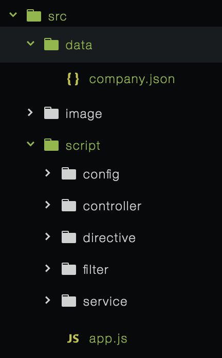

### 一、安装相关工具
* node
* batarang: angular调试工具
* bower
> 安装bower  cnpm install -g bower
1. 常用bower命令： bower init bower install bower uninstall
2. 配置文件： .bowerrc 修改安装目录   bower.json 主配置文件

        //初始化npm
        npm init
        //全局安装bower
        cnpm install -g bower
        //初始化bower配置文件
        bower init

### 二、目录结构说明
#### 1 根目录结构如下：

* src:源码
* build: 构建代码编译之后的目录，用于调试
* dist:产品发布的目录
* bower_components: bower的默认软件安装目录
* test: 存放单元测试的目录
* .eslintrc: 语法检查配置文件
* bower.json: bower的配置文件
* gulpfile.js : gulp任务代码
* package.json: node的配置文件
#### 2 src目录结构如下：

* data： 存放json数据目录，本地测试数据
* image: 图片
* style: css目录
* view： 视图目录
        template: 模板目录
        404.html
        index.html

* script: js存放目录
#### 3 script目录结构如下：
* config: 启动配置目录，app.js启动时读取config中的配置信息
* controller: 控制器目录
* directive: 自定义指令目录
* filter:过滤器目录
* service: 服务目录
* app.js: 项目启动文件

---

### 三、自动化构建工具 gulp
>优点：基于流，任务化

#### 1 常用命令
* src: 读取文件和文件夹
* dest: 生成文件
* watch： 监控文件变化
* task: 定制任务
* pipe: 用流的方式处理文件

#### 2 gulp 中文网
* gulpjs.com.cn

#### 3 使用

        1. 全局安装gulp
        npm install -g gulp
        2. 在当前目录安装gulp并写入node配置文件
        npm install gulp --save-dev

        3. 安装gulp相关模块
            gulp
            gulp-clean
            gulp-concat
            gulp-connect
            gulp-cssmin
            gulp-imagemin
            gulp-less
            gulp-load-plugins
            gulp-uglify
            open

            cnpm install --save-dev gulp-clean gulp-concat gulp-connect gulp-cssmin gulp-imagemin gulp-less gulp-load-plugins gulp-uglify open

#### 4. 在gulpfile.js中 编写task任务
            lib
            html
            json
            css
            js
            image
            clean
            reload
            watch

---
            gulpfile.js
            //引入gulp
            var gulp = require('gulp');
            //引入gulp插件加载模块
            var $ = require('gulp-load-plugins')();//后面括号不能省略
            //
            var open = require('open');
            //引入less编译
            var gulpless = require('gulp-less');
            //css压缩
            var cssmin = require('gulp-cssmin');

            //用来定义目录路径
            var app = {
                srcPath:'src/',//源码路径
                devPath:'build/',//开发目录
                prdPath:'dist/'//生产目录
            }

            //lib任务 ：将bower安装的第三方文件，拷贝到

            gulp.task('lib',function(){
                // 读取bower_components目录下面的所有文件
                gulp.src('bower_components/**/*')
                //拷贝到开发目录
                .pipe(gulp.dest(app.devPath+'vendor'))
                //拷贝到生产目录
                .pipe(gulp.dest(app.prdPath+'vendor'))
                //通知服务器刷新浏览器
                .pipe($.connect.reload())

            })
            //命令行执行 gulp lib 测试一下

            //html任务：将src所有的html文件拷贝 到开发和测试目录下
            gulp.task('html',function(){
                //读取src/目录下所有的html文件
                gulp.src(app.srcPath+"**/*.html")
                // 拷贝到开发目录
                .pipe(gulp.dest(app.devPath))
                //拷贝到生产目录
                .pipe(gulp.dest(app.prdPath))
                .pipe($.connect.reload())
            })

            //命令行执行 gulp html 测试一下

            //json 任务：将模拟数据拷贝到开发生产目录
            gulp.task('json',function(){
                gulp.src(app.srcPath+'data/**/*.json')
                .pipe(gulp.dest(app.devPath+'data'))
                .pipe(gulp.dest(app.prdPath+'data'))
                .pipe($.connect.reload())
            })
            //命令行执行 gulp json 测试一下

            //less任务： 将less
            //style/index.less中引入@import所有其他的less文件，编译只需要处理它即可
            gulp.task('less',function(){
                //读取sytle/index.less文件
                gulp.src(app.srcPath+'style/index.less')
                    //将less编译为css文件
                    .pipe(gulpless())
                    //将编译好的css文件放入开发目录的css文件夹中
                    .pipe(gulp.dest(app.devPath+'css'))
                    //将css文件压缩
                    .pipe(cssmin())
                    //将压缩的文件放入生产目录的css文件夹中
                    .pipe(gulp.dest(app.prdPath+'css'))
                    .pipe($.connect.reload())
            })

            //js任务
            gulp.task('js',function(){
                //读取script目录下所有js文件
                gulp.src(app.srcPath+'script/**/*.js')
                //将这些js文件合并成一个 index.js
                .pipe($.concat('index.js'))
                //放入开发目录下
                .pipe(gulp.dest(app.devPath+'js'))
                //压缩js
                .pipe($.uglify())
                //放入声场目录下
                .pipe(gulp.dest(app.prdPath+'js'))
                .pipe($.connect.reload())
            })

            //image任务
            gulp.task('image',function(){
                gulp.src(app.srcPath+'image/**/*')
                .pipe(gulp.dest(app.devPath+'image'))
                .pipe($.imagemin())
                .pipe(gulp.dest(app.prdPath+'image'))
                .pipe($.connect.reload())
            })

            //清除
            gulp.task('clean',function(){
                //读取开发目录和生产目录
                gulp.src([app.devPath,app.prdPath])
                //清楚所有文件
                .pipe($.clean());
            })

            //总任务 build
            gulp.task('build',['image','js','less','lib','html','json'])

            //开启服务
            gulp.task('serve',function(){
                $.connect.server({
                    //默认从开发目录读起
                    root:[app.devPath],
                    //刷新浏览器
                    livereload:true,
                    port:8888
                });
                open('http://localhost:8888');
                //自动构建监听变动
                gulp.watch(app.srcPath+'script/**/*.js',['js']);
                gulp.watch('bower_components/**/*',['lib']);
                gulp.watch(app.srcPath+'**/*.html',['html']);
                gulp.watch(app.srcPath+'data/**/*.json',['json']);
                gulp.watch(app.srcPath+'style/**/*.less',['less']);
                gulp.watch(app.srcPath+'image/**/*',['image']);
            })
            //命令行输入 gulp 默认执行 gulp serve
            gulp.task('default',['serve']);

---

### 四、模块划分
* 职位
* 搜索
* 用户

### 五、单页面应用入口文件 src/index.html

#### 1 引入angular

        

        

        <html lang="en" ng-app="app">

#### 2 src/script/app.js

        angular.module('app',[]);

---

### 六、路由配置

#### 1. 安装 ui-router

        bower install --save ui-router

#### 2. gulp lib

#### 3. 在src/index.html中引入 angular-ui-router

        

#### 4. 修改app.js,加入依赖模块

        angular.module('app',['ui.router']);

#### 5. src/script/config/router.js ，路由配置

        angular.module('app').config(['$stateProvider','$urlRouterProvider',function($stateProvider,$urlRouterProvider){
            $stateProvider.state('main',{
                url:'/main',
                templateUrl:'view/main.html',
                controller:'mainCtrl'//命名规则，页面名+ctrl
            })
            $urlRouterProvider.otherwise('main');
        }])

#### 6. src/index.html加入ui-view标签让页面显示

        

#### 7. 解决mainCtrl找不到报错  src/script/controller/mainCtrl.js

        angular.module('app').controller('mainCtrl',['$scope',function($scope){

        }])

### 七、路由常用方法
#### 1 路由参数及匹配
        /home 只匹配 /home
        /user/:id   /user/{id} 匹配 /user/123 或 /user/
        /message?a=1&b=2

#### 2 跳转方式

* <a ui-sref="main({id:123})">跳转</a>
* 使用$state服务的go方法跳转

        $state.go('main',{id:123},{location:'replace'})  //location:replace 回退的时候不会回退到当前页面

#### 3 参数获取

        $state.param.id  <==> $stateParam.id

### 八、移动端自适应rem  src/index.html

        

### 九、使用指令组合main.html页面
#### 1 src/view/main.html 用header footer content三个指令拼成页面

        

            <app-header></app-header>
            <app-content></app-content>
            <app-footer></app-footer>
        

#### 2 src/view/template/header.html

        

            10秒定制职位
            <button>去定制</button>
        

#### 3 创建指令 src/script/directive/header.js

        angular.module('app').directive('appHeader',[function(){
            return {
                restrict:'E',
                replace:true,
                templateUrl:'view/template/header.html'
            }
        }])

### 十、 移动端字体、宽、高自适应

#### 1 修改 src/style/index.less

        .fs(@px){
            font-size:unit(@px / 37.5,rem);
        }
        .w(@px){
            width:unit(@px / 37.5,rem);
        }

        .h(@px){
            height:unit(@px / 37.5,rem);
        }
        body{
            .fs(16)
        }

#### 2 index.html页面引入 css

        <link rel="stylesheet" href="css/index.css">
